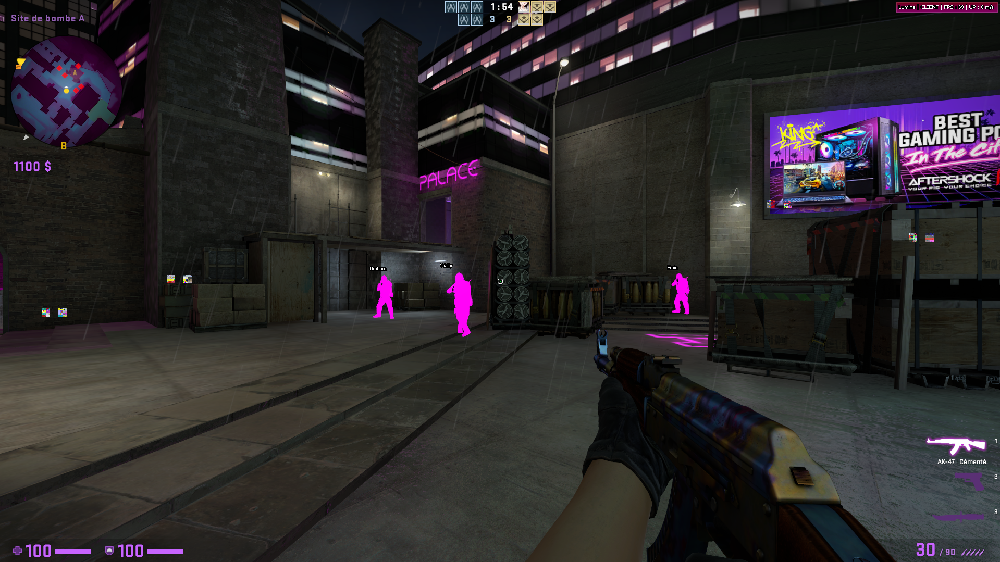

# IMPORTANT UPDATE

Since people definitly don't know how to use this, things will change from now.

Why ? Because the non-mutated version of the cheat is now detected by AV's as HackTool:Win32/GameHack.*, this mean that the NON-MUTATED VERSION was injected using bad injectors in CSGO. But the point of the cheat is to use mutation to maintain a changing signature. If you don't know how to use it with VMProtect, you should not use it at all. Before trying to cheat in CSGO, you should know about computer science and game hacking in the first place before trying to be a l33t ch3at3r. If you are just a random kid that saw a video talking about cheats on yt, and you've downloaded VS to compile a cheat that you plan to modify to pretend it's our own one. You will be VACED because you don't even know how to properly use this kind of things.

Since the first upload, there are some anti-paste / anti-run in my cheat, but now I will make sure no one that want to cheat for bad purposes can do it without knowledge. If you are in RE or game hacking, it's not a big deal to avoid.

# What is it ?

This is the CSGO cheat I'm coding since 2018.

# Why ?

I've coded this because there are too many cheaters in this game. I'm angry that I can't do anything against cheaters with the vanila CSGO. So I'm cheating ONLY against cheaters.

# Is it detectable ?

Well.

The cheat by itself (the file, the code) is not "identifiable" because of code mutation. I'm using VMP mutation for every functions I made, and the compilation doesn't split that much the code regarding the mutation (at least with my current configuration).

So if you use it mutated on VAC protected servers, Steam anti cheat will not be able to find any known patterns because of code mutation. Even if VAC detect the module and send it to Valve's servers to "extract" sigatures, next time the cheat is compiled, its code signature will completly change (my functions). So VAC cannot identify the cheat by a code signature of my features. However, I use public code that could be flagged by VAC (JsonCpp, ZGUI, ...), but those codes are commonly used by legit softwares. And if VAC flag them, they will flag most of the overlay software too, so they don't do it. 

So let's summarize, the code signature is not detectable, is the cheat still detectable then ? YES

The first vector could be the DLL injection. In my case the CSGO process load by itself the crashhandler.dll, so the module is loaded before the installation of LoadLibrary and other hooks. But if the injection process is spotted by CSGO process, you will be VAC.

The second is to consider the "pattern" detection of the cheat. For exemple if VAC is now able to detect a feature of the cheat, no matter its implementation. You will be VAC, as well as skeet users when double tap was detected by CSGO. So maybe tomorow, the Faststop feature could be detected server side. 

I could continue my explanation for hours (string, data...) but I think you get the idea.

# Why do I release this then ?

Like I explained earlier, the point of being not detected regarding the code is highly liked to knowledge of VAC about it. So, more people use it, more chance that it's "detected", even if I use code mutation. 

But I've spend a lot of time working on this game, and I think it's now time to do release it as I'm not playing that much anymore.

# How to compile it ?

Compile in Release mode to be sure that the code is mutated. Modify the `sign.bat` file and set your VMProtect path and grab the last `crashhandler.dll` signature as `crashhandler.original.sig`.

# How to use ?

Place the `crashhandler.dll` file Steam's root folder. CSGO will load it before applying the LoadLibrary hook.

# Features

Like I said, it's a legit cheat, so features are meant to be hidden regarding overwatch. But it's depending of your own gameplay.

- Chams
    - Enemy
    - Backtrack
    - Hands and Steeves 
- Glow
- Skin Changer (two slots, T and CT)
    - Weapon (paint, stickers, ...) 
    - Knife 
    - Local Model
    - Team Model
- ESP
    - Show only if dead
    - Box
    - Name
    - Life
    - Indicators (flash, scope, has defuser, has bomb, planting, defusing, ...)
- Grenade Prediction
- Radar
- Backtrack
- Misc
  - My Spread Circle + Crosshair (not the classic filled cirle)
  - Hitmarker + Sound
  - Spectator List
  - Fast Stop
  - Silent Walk
  - Flash Timer
- Bypasses
  - 3 Party Files
  - Signature Checks

# About the code

I made the cheat optimized, but there is one thing that is not looking good in all this project, the UI.

I started to made the UI from raw, but at the end I didn't want to put too much effort into it. So I used the zgui framework to handle it, and I didn't took the time to modify the gui, buttons and stuff. So the menu (the button and UI) are pretty huggly, but I prefer to work on features instead of loosing time on this.

It's why I don't provide screenshots of the menu.

# Preview video

# Logs

- 10-03-2021 v0.1.12
  - Added a new way to grab interfaces since VAC monitors CreateInterface calls now [(see)](https://www.unknowncheats.me/forum/counterstrike-global-offensive/444181-vac-monitors-createinterface-calls.html#post3084991)
  - "Policy" update
  - Improved API resolver (export resolved from PEB, without GetProcAddress)
  - Improved execution speed of backtrack
  - Updated `crashhandler.dll` certificat
- 07-03-2021 v0.1.11 
  - Added old Natacha features 
  - Added chams overlay
  - Added backtrack and backtrack chams
  - Fix knife applied to spectators
- 19-02-2021 v0.1.10  
  - Fix knife animations
  - Fix hand chams bug
- 05-02-2021 v0.1.9  
  - Added hands and sleeves color changer
- 27-01-2021 v0.1.8  
  - Added world modulation and
  - Removed strcmp (using hash)
- 07-01-2021 v0.1.7 
  - Official release
- 14-09-2019 v0.1.0 
  - Merging Natacha project to Lumina project
- 05-06-2018 v0.0.0  
  - Starting the project

# Bugs

There is still a bug when you plant a bomb, sometimes it crashes but it's too rare, so I can't debug it.

# Credit

- Oneshot
- coders from legendware
- fatality.win 2018 source code
- JsonCpp http://jsoncpp.sourceforge.net/
- zxvnme (zgui)
- coders from pandoracheats.pw
- Ferenc Deak, Sebastien Andrivet https://github.com/andrivet/ADVobfuscator
- Justas Masiulis https://github.com/JustasMasiulis/lazy_importer, https://github.com/JustasMasiulis/xorstr
